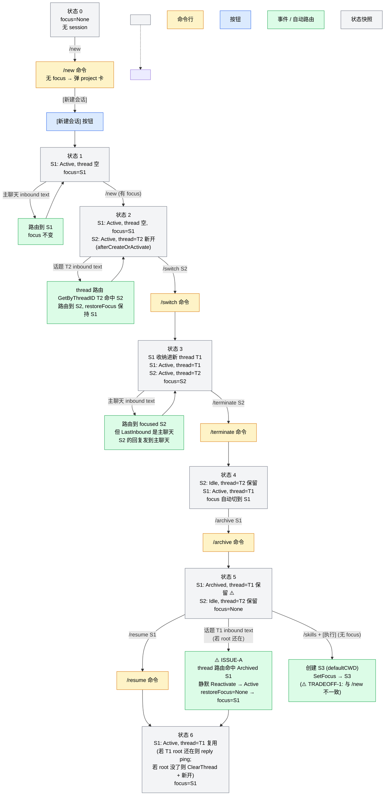
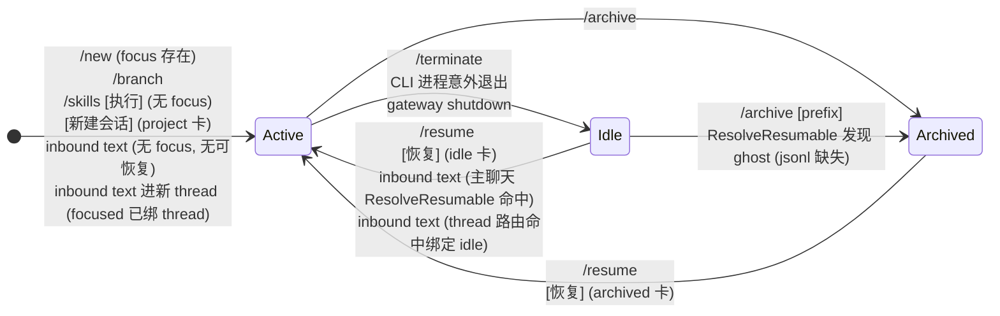
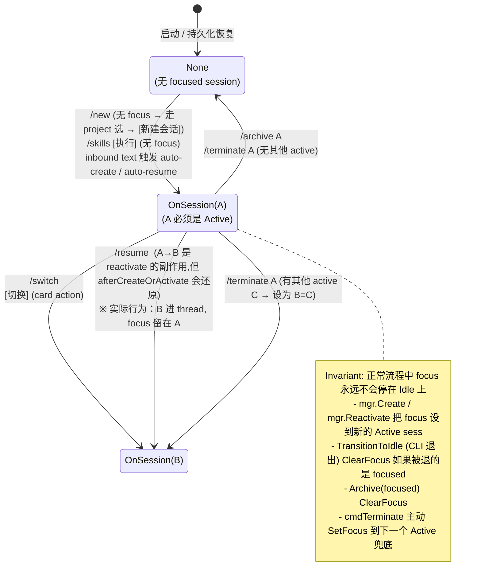
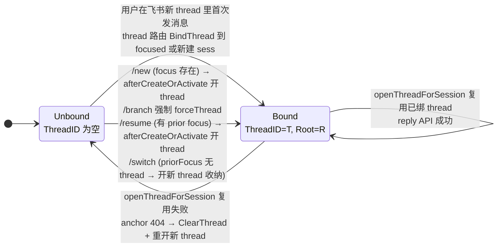
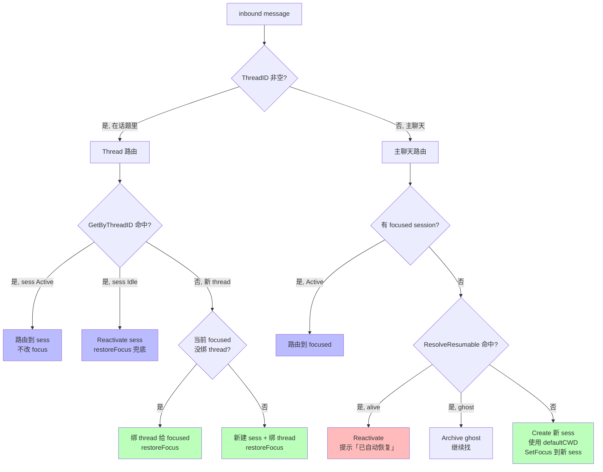

# Session / Thread / Focus 状态机

本文档梳理 claude-code-gateway 在飞书 (Lark) 多 session 场景下的三个核心状态机及其触发器。

约定：
- `/cmd` = 用户在输入框打的命令行
- `[按钮]` = 卡片上的按钮
- `inbound text` = 用户在主聊天或话题里发的纯文本（非命令）

---

## 路由优先级（V2 顶层原则）

所有 session 路由/Focus/Thread 决策按以下顺序应用，**前者优先级最高**：

1. **复用已有 thread**：若 session 已有 ThreadID 绑定，任何"恢复/激活/转发"的行为都路由进该 thread；不开新 thread，不让该 sess 抢主聊天 focus。
2. **保护已有 focus**：若用户当前主聊天有 Active focus，新创建/恢复的 session 一律进新 thread；priorFocus 保持。
3. **主聊天作为默认容器**：无 thread、无 priorFocus 时，新 session 才接管主聊天 focus。
4. **主聊天只承载命令/全局动作**：thread 内只做该 session 自身的对话。

实现要点：
- 原则 1 由 `afterCreateOrActivate` 在 `priorFocus == nil` 分支显式检查 `newSess.ThreadID` 落地 —— 命中则 `ClearFocus` 并把 welcome 发进既有 thread。
- 原则 2 由 `snapshotFocus` + `afterCreateOrActivate` 主路径落地。
- 原则 3 是默认行为（mgr.Create / Reactivate 直接 SetFocus 到新 sess）。
- 原则 4 由各命令的 `m.ThreadID != ""` 拒绝分支落地。

---

## 0. 总览：典型用户旅程

下图把三个状态机（Session/Focus/Thread）绑到一条典型多 session 使用流程上，每个节点标注三个维度的状态快照。

> 图例：黄底=命令行，蓝底=按钮，绿底=事件/自动路由，灰底=状态快照。
> ⚠️ 标注处对应第 6 节列出的 ISSUE-A / TRADEOFF-1。

---

## 1. Session Status FSM (per-session)

**说明**
- Active = CLI 进程在跑
- Idle = CLI 进程已退出但 session 记录保留 (CLISessionID/ThreadID 都还在)，可 `--resume` 复活
- Archived = 用户显式归档；UI 单独区收纳
- Reactivate 会创建一个新的 manager-internal session record（新 gateway ID），但 CLISessionID/ThreadID/RootMessageID 全保留 → 用户视角上"还是同一个 session"

---

## 2. Focus FSM (per-user，单 focus 槽)

**关键不变量**：focus 只可能是 `None` 或指向 `Active` session。
**例外**：极短 race window（/terminate 调用 sess.Close 后到 TransitionToIdle 触发之间，通常微秒级）。

---

## 3. Thread Binding FSM (per-session 字段：ThreadID + RootMessageID)

**说明**
- 一个 session 同一时刻只能绑 1 个 thread
- `openThreadForSession` 会先检查 ThreadID — 已绑就 reply 复用，避免重复开
- thread 路由（用户在飞书新 thread 发消息）也只在 focused 没绑 thread 时才绑给 focused，否则新建 session

---

## 4. 整体路由决策（inbound 消息）

---

## 5. 命令 × 状态影响矩阵（速查表）

| 命令/按钮 | 入口 | Session Status 变化 | Thread 变化 | Focus 变化 |
|---|---|---|---|---|
| `/new` (focus 存在) | 主聊天 | + 1 Active (focus.dir) | 新 sess 开新 thread | 保持 prior |
| `/new` (无 focus) | 主聊天 | — (弹 project 卡) | — | — |
| `/new` | 话题 | 拒绝 | — | — |
| `/list` / `/project` | 主聊天 | — | — | — |
| `/list` / `/project` | 话题 | 拒绝 | — | — |
| `/switch <prefix>` (target Active) | 主聊天 | — | priorFocus 无 thread→开新 thread 收纳；有 thread→ping | → target |
| `/switch <prefix>` (target Idle/Archived) | 主聊天 | 拒绝 → 提示用 /resume | — | — |
| `/resume <prefix>` (Idle/Archived) | 主聊天/话题 | Reactivate → Active | 有 prior focus→开 thread；无→不开 | 有 prior 保持；无→新 sess |
| `/resume <prefix>` (Active) | 主聊天 | 拒绝 → 提示用 /switch | — | — |
| `/branch [name]` | 主聊天 | + 1 Active (fork) | fork 进新 thread (forceThread) | 保持父 |
| `/branch` | 话题 | 拒绝 | — | — |
| `/archive [prefix]` | 双 | Active/Idle → Archived | **ThreadID 不清** | 若 archived 是 focused → None |
| `/stop [prefix]` | 双 | — (打断当前 turn) | — | — |
| `/terminate [prefix]` | 双 | Active → Idle | — | 有其他 active→切；无→None |
| `/rename [prefix] <name>` | 双 | — | — | — |
| `/model` `/diff` `/status` `/help` `/plan-list` `/config` | 双 | — | — | — |
| `/skills` | 双 | — | — | — |
| `/skills` → `[执行]` (有 focus) | 双 | — | — | — |
| `/skills` → `[执行]` (无 focus) | 双 | + 1 Active (defaultCWD) | — | → 新 sess |
| `/cron ...` | 双 | (可能 spawn worker sess) | — | — |
| **卡片按钮** | | | | |
| `[展开]` (project 卡) | 主聊天 | — | — | — |
| `[进入]` (projects 卡 V2) | 主聊天 | — | — | — |
| `[新建会话]` (project 卡) | 主聊天 | + 1 Active (该项目 dir) | 同 /new (focus 存在/无) 规则 | 同上 |
| `[恢复]` (idle/archived 卡) | 双 | Reactivate → Active (异步) | 同 /resume | 同 /resume |
| `[切换]` (active 卡) | 主聊天 | — | 同 /switch | → target |
| `[归档]` (active 卡) | 双 | → Archived | ThreadID 不清 | 若 focused → None |
| `[执行]` (skill 卡) | 双 | 同 /skills [执行] | — | 同上 |
| `[刷新摘要]` | 双 | — (worker 异步重生成 summary) | — | — |
| `[重命名]` | 双 | — | — | — |
| **inbound 文本** | | | | |
| 主聊天 + 有 focus Active | 主聊天 | — | — | — |
| 主聊天 + 无 focus | 主聊天 | ResolveResumable→Reactivate / 或 Create | — | → 命中/新建的 sess |
| 话题 + 已绑 sess Active | 话题 | — | — | restoreFocus 保持 prior |
| 话题 + 已绑 sess Idle | 话题 | Reactivate → Active | — | restoreFocus 保持 prior |
| 话题 + 新 thread, focus 未绑 | 话题 | — (复用 focused) | 新 thread 绑给 focused | restoreFocus |
| 话题 + 新 thread, focus 已绑 | 话题 | + 1 Active (defaultCWD) | 新 thread 绑给新 sess | restoreFocus |

---

## 6. 已知问题与设计取舍（修订版）

修订过程：先列出怀疑点 → 跟着代码逐条验证 → 确认/撤回。

### ❌ 已撤回（误判）

**BUG-1 / BUG-2（focus 停在 Idle 上）**
之前担心 `/terminate` 让 focus 留在 idle session 上、然后 inbound text 写入失败。
**验证后撤回**：
- `cmdTerminate` (bridge `commands.go:761-770`) 终止后会找下一个 Active 并 SetFocus；
- 若无其他 Active，`TransitionToIdle` (`lifecycle.go:625-628`) 在 CLI 退出时主动 ClearFocus；
- 两者结合保证 focus 永远不会停在 Idle 上（除微秒级 race window）。

**BUG-3（重复 BindThread 覆盖 ThreadID）**
之前担心 BindThread 被反复调用覆盖。
**验证后撤回**：
- `openThreadForSession` (`bridge.go:622-642`) 显式检查 ThreadID 已绑就 reply 复用；
- 主聊天 thread 路由 (`bridge.go:353`) 只在 `focused.ThreadID == ""` 时才把新 thread 绑给 focused；
- 没有路径会覆盖已有 ThreadID。

**BUG-4（/branch 父 idle 不被 reactivate）**
之前担心 `/branch` 在父 idle 时跑出怪异状态。
**验证后撤回**：BUG-1 撤回后，focus 不可能是 Idle，cmdBranch 拿到的 `priorFocus` 必为 Active 或 nil。

---

### ⚠️ 有兜底但语义模糊

**ISSUE-A: `/archive` 不清 ThreadID**
归档后 ThreadID 仍留在 session record 上。`/resume` 后 ThreadID 写回新 sess。如果用户在那个 thread 里发消息，`GetByThreadID` 命中复活的 sess，类似"归档复活"。
**风险**：用户语义上"归档了"但 thread 没被切断。
**兜底**：飞书侧 thread root 若被删，`openThreadForSession` 会 ClearThread + 重开新 thread。
**修复建议（可选）**：Archive 时一并 ClearThread，明确语义。

---

### 🐛 真 UX bug

**BUG-7: `/switch <idle-prefix>` 拒绝并指向 /resume** ✅ **已修**
- 旧：`cmdSwitch` → `FindByPrefix` 包含 idle → `switchFocusTo` 拒绝 → 提示用户改打 /resume。
- 新：cmdSwitch 命中非 Active 时直接走 `resumeSessionFlow`，等价 [恢复] 按钮的同步版本。
- 提取了共享 helper `resumeSessionFlow(ctx, m, sess)` 给 cmdSwitch 和 resume_session card action 共用。

**BUG-8: `[恢复]` 按钮异步化后没有即时反馈** ✅ **已修**
- 旧：handler 立即 return 异步跑 Reactivate，30 秒空窗用户无任何反馈。
- 新：goroutine 启动前 `m.Reply` 占位卡 "正在恢复 session xxx ｜ CLI 冷启动需 10-30 秒"，原 list 卡被替换；async 完成后仍然 `replyCard` 出 "Session Resumed" 新卡。

---

### 🎨 Design tradeoff（已确认，不算 bug）

**TRADEOFF-1: `/skills [执行]` vs `/new` 无 focus 行为不一致**
- `/new` 无 focus → 弹 project 选择器（要求用户先挑项目）
- `/skills [执行]` 无 focus → 直接在 defaultCWD 建并执行
- **现状**：是用户明确选定的（"defaultCWD 执行呗"）；偏好"低摩擦执行 skill" > "强制选项目"。

**TRADEOFF-2: 重启后第一条主聊天消息可能抓到 thread-bound session**
- `ResolveResumable` 的注释明确：thread-bound session 也是合法的 main-chat resume 候选。
- 用户经历过这个：重启后随便发条消息，focus 飘到某个 thread-bound idle session 上。
- **现状**：是有意设计的（thread 不独占 session）。如果要改：在 ResolveResumable 优先级里把 "未绑 thread" 排前。
